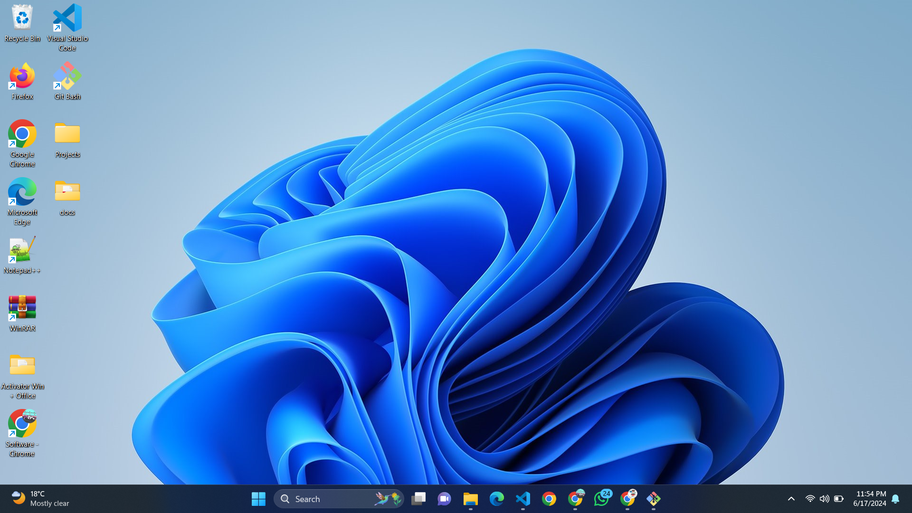
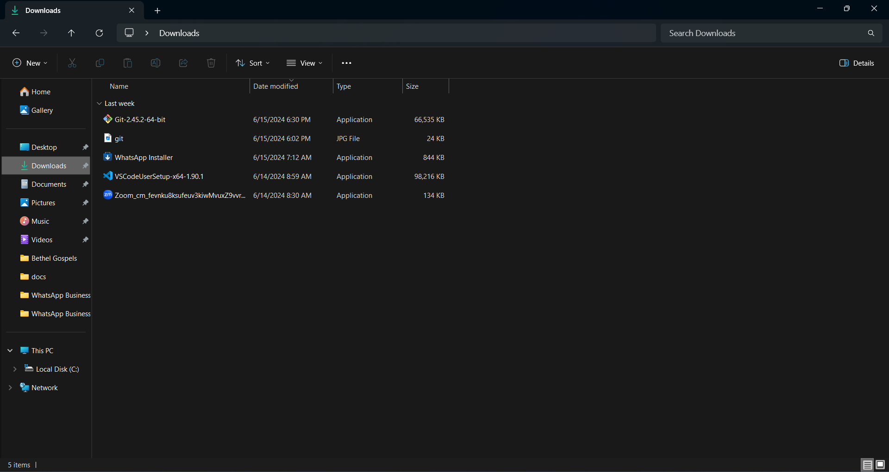
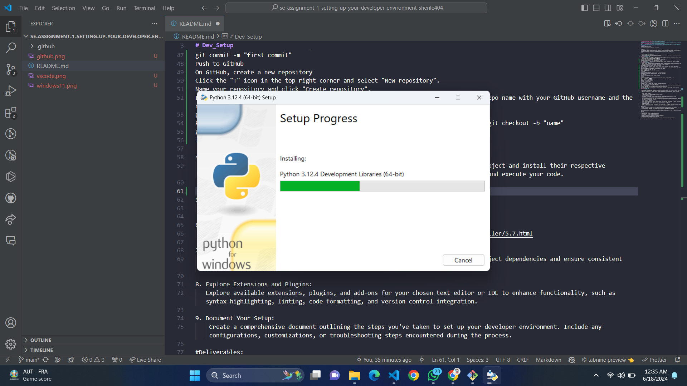
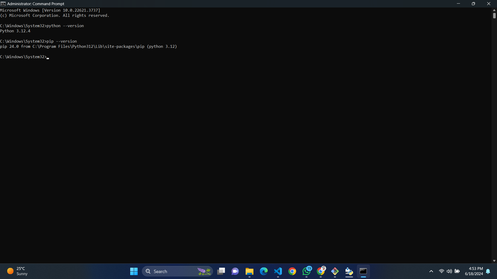
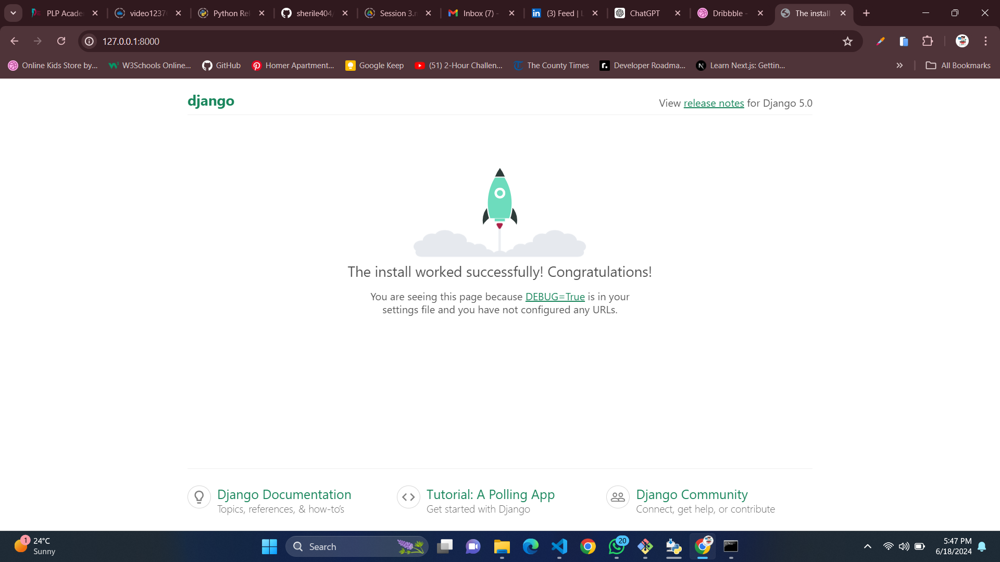
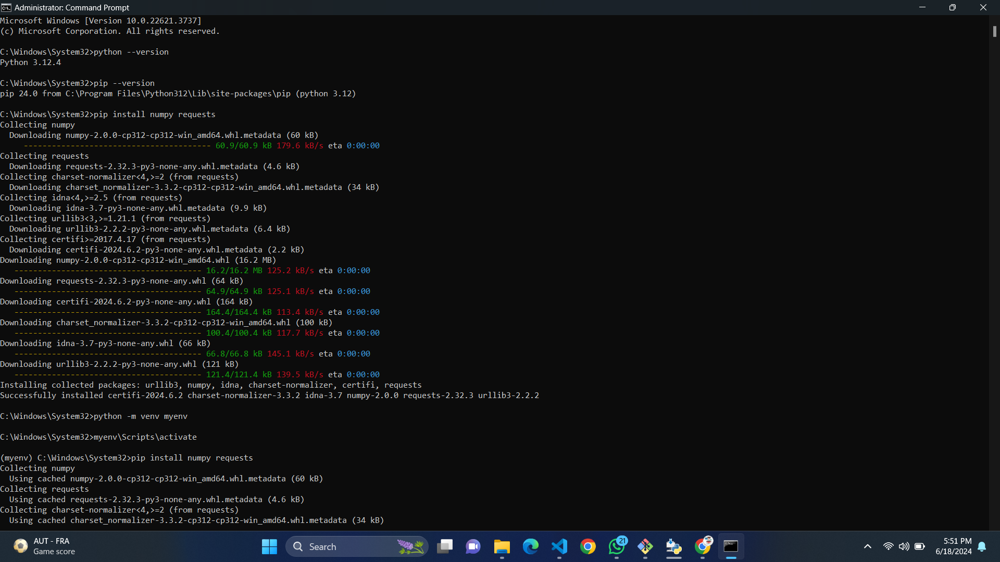
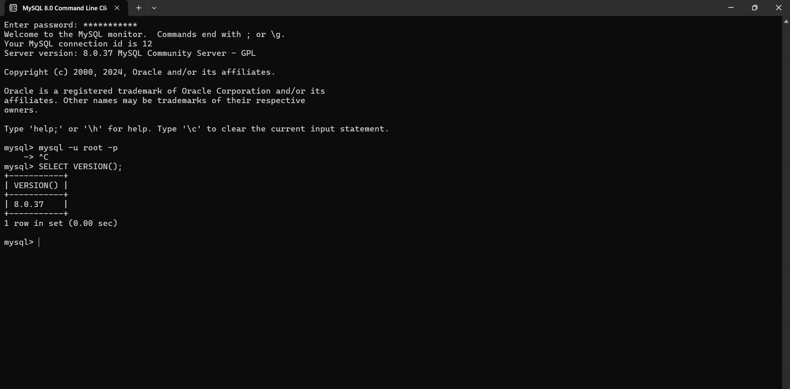

# Dev_Setup
Setup Development Environment

#Assignment: Setting Up Your Developer Environment

#Objective:
This assignment aims to familiarize you with the tools and configurations necessary to set up an efficient developer environment for software engineering projects. Completing this assignment will give you the skills required to set up a robust and productive workspace conducive to coding, debugging, version control, and collaboration.

#Tasks:

1. Select Your Operating System (OS):
   Choose an operating system that best suits your preferences and project requirements. Download and Install Windows 11. https://www.microsoft.com/software-download/windows11

Using Bootable USB Drive
Insert the bootable USB drive into your PC.
Restart your PC and enter the BIOS/UEFI settings (usually by pressing a key like F2, F12, Delete, or Esc during startup).
Set the USB drive as the primary boot device.
Save the changes and exit BIOS/UEFI.
Your PC will boot from the USB drive, starting the Windows 11 installation process.
Follow the on-screen instructions to complete the installation.

2. Install a Text Editor or Integrated Development Environment (IDE):
   Select and install a text editor or IDE suitable for your programming languages and workflow. Download and Install Visual Studio Code. https://code.visualstudio.com/Download

Visit the Visual Studio website and click on "Download Visual Studio."
Run the downloaded installer.
Click the "Install" button to start the installation process.
Once the installation is complete, launch Visual Studio.

3. Set Up Version Control System:
   Install Git and configure it on your local machine. Create a GitHub account for hosting your repositories. Initialize a Git repository for your project and make your first commit. https://github.com

   On Windows:
Download the Git installer from the official Git website.
Run the installer and follow the prompts. Use the default settings unless you have specific requirements.
 Configure Git
Open your terminal or command prompt and run the following commands to set up your Git username and email. Replace "Your Name" and "your.email@example.com" with your actual name and email address.
git config --global user.name "Your Name"
git config --global user.email "your.email@example.com"
 Create a GitHub Account
Go to GitHub.
Click on "Sign up" and follow the instructions to create a new account.
 Initialize a Git Repository
Create a new directory for your project if you don't have one already.
mkdir my-project
cd my-project
Initialize a Git repository in your project directory
git init
 Make Your First Commit
Create a new file or add existing files to your project. For example, create a README.md file
echo "# My Project" > README.md
Add the file(s) to the staging area
git add .
Commit the files to the repository
git commit -m "first commit"
Push to GitHub
On GitHub, create a new repository
Click the "+" icon in the top right corner and select "New repository".
Name your repository and click "Create repository".
Link your local repository to the GitHub repository. Replace your-username and your-repo-name with your GitHub username and the name of your repository:
git remote add origin https://github.com/your-username/your-repo-name.git
Push your local commits to GitHub either to main or create a new branch by using the git checkout -b "name"
git push -u origin main

4. Install Necessary Programming Languages and Runtimes:
  Instal Python from http://wwww.python.org programming language required for your project and install their respective compilers, interpreters, or runtimes. Ensure you have the necessary tools to build and execute your code.

Install Python
Run the installer you downloaded. Make sure to check the box that says "Add Python to PATH" before clicking "Install Now." This ensures you can run Python from the command line.
Follow the on-screen instructions to complete the installation.
Verify Installation
Open a command prompt or terminal and type the following command to verify that Python is installed correctly
python --version
Install pip (Python's Package Installer)
pip is included by default in Python 3.4 and later. Verify pip installation
pip --version

5. Install Package Managers:
   If applicable, install package managers like pip (Python).
pip is included by default with Python installations starting from Python 3.4. To check if pip is installed, open Command Prompt and type:
pip --version
If pip is not installed, you can manually install it using the following commands:
python -m ensurepip --upgrade
After installing, you can verify that pip is correctly installed by typing:
pip --version

6. Configure a Database (MySQL):
   Download and install MySQL database. https://dev.mysql.com/downloads/windows/installer/5.7.html

7. Set Up Development Environments and Virtualization (Optional):
   Consider using virtualization tools like Docker or virtual machines to isolate project dependencies and ensure consistent environments across different machines.

8. Explore Extensions and Plugins:
   Explore available extensions, plugins, and add-ons for your chosen text editor or IDE to enhance functionality, such as syntax highlighting, linting, code formatting, and version control integration.

9. Document Your Setup:
    Create a comprehensive document outlining the steps you've taken to set up your developer environment. Include any configurations, customizations, or troubleshooting steps encountered during the process. 

#Deliverables:
- Document detailing the setup process with step-by-step instructions and screenshots where necessary.
- A GitHub repository containing a sample project initialized with Git and any necessary configuration files (e.g., .gitignore).
- A reflection on the challenges faced during setup and strategies employed to overcome them.

#Submission:
Submit your document and GitHub repository link through the designated platform or email to the instructor by the specified deadline.

#Evaluation Criteria:**
- Completeness and accuracy of setup documentation.
- Effectiveness of version control implementation.
- Appropriateness of tools selected for the project requirements.
- Clarity of reflection on challenges and solutions encountered.
- Adherence to submission guidelines and deadlines.

Note: Feel free to reach out for clarification or assistance with any aspect of the assignment.
